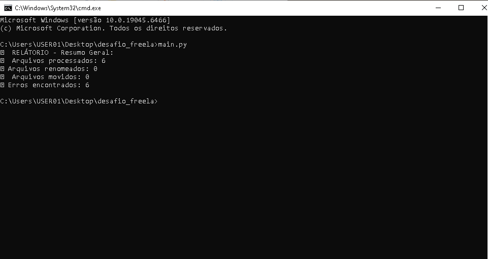
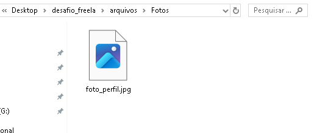

# File Organizer

> Beginner-friendly Python automation project that renames, organizes, and moves files using an Excel spreadsheet as input.

## Features

- Reads `.xlsx` files
- Creates folders automatically
- Renames files
- Moves files to their respective folders
- Generates a `.log` report with execution details and possible errors

## Technologies

- Python
- Pandas
- Logging
- os
- shutil

## How It Works

The project uses an Excel spreadsheet as input. The spreadsheet must contain the following columns:

- Original file name (e.g., `old_file.png`)
- New file name (e.g., `new_file.png`)
- File category (e.g., Documents, Finance, Images, etc.)

After reading the spreadsheet, the script will:

- Create folders based on the file categories
- Rename the files according to the spreadsheet
- Move the files to their corresponding folders
- Generate a log report with useful information and possible errors

## How to Run

Follow the steps below:

1. Clone this repository.
2. Install Python from the official website:
[Python Downloads](https://www.python.org/downloads/)

3. Install the required dependencies:

```bash
pip install pandas openpyxl
```

4. Place your Excel spreadsheet in the project directory following the structure described above.
5. Run the project:

```bash
python main.py
```

## Project Structure

```text
project/
│
├── arquivos/
│   └── .gitkeep
├── imagens/
├── main.py
├── planilha.py
├── arquivos.py
├── planilha_exemplo.xlsx
├── README.md
└── .gitignore
```

## License

This project was developed for study and portfolio purposes.

## Screenshots

### Project Structure


### Terminal Execution



### Example Spreadsheet


### Generated Folders


### Organized Files

